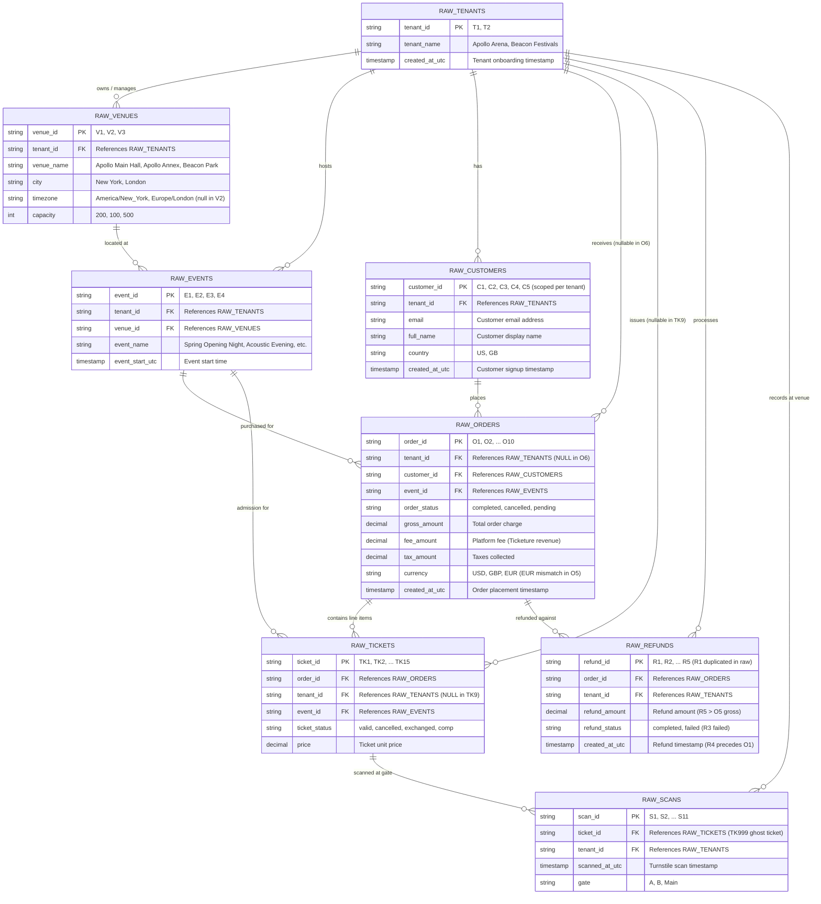

# Raw Data Entity-Relationship Diagram (ERD)

This document diagrams the raw tables landed in `/seeds` and describes their schema, relationships, and raw data anomalies.

---

## Entity-Relationship Diagram

---

## Key Data Anomalies Noted in Raw Seeds

1. **`raw_refunds`**:
   - `R1`: Exact duplicate row present in raw CSV.
   - `R4`: Timestamp `2025-02-19 08:00:00` precedes the order `O1` timestamp `2025-02-20 11:00:00`.
   - `R5`: Refund amount (`150.00`) exceeds the gross order amount of `O5` (`100.00`).
   - `R3`: Status is `failed` and must not reduce net revenue.

2. **`raw_orders`**:
   - `O6`: `tenant_id` is `NULL` (inferred from Event `E3` $\rightarrow$ `T2`).
   - `O5`: Currency is `EUR` whereas Tenant `T2` home currency is `GBP`.
   - `O3` (`cancelled`) and `O7` (`pending`): Non-completed orders excluded from net revenue.
   - `O9`: Gross amount is `250.00`, but its 2 tickets (`TK13`, `TK14`) sum to `200.00` ($50 gap).

3. **`raw_tickets`**:
   - `TK9`: `tenant_id` is `NULL` (inferred from Event `E3` $\rightarrow$ `T2`).
   - `TK2`: Status `exchanged`.
   - `TK4`: Status `cancelled` (from cancelled order `O3`).
   - `TK11`, `TK12`: Status `comp` with price `0.00`.

4. **`raw_scans`**:
   - `S6`: Scans `TK999` which does not exist in `raw_tickets` (ghost/unregistered ticket).
   - `S5`: Scans `TK4` (cancelled ticket).
   - `S7`: Scans `TK2` (exchanged ticket).
   - `TK1`: Scanned 3 times across Gates A and B (`S1`, `S2`, `S3`).

5. **`raw_venues`**:
   - `V2`: `timezone` is empty/null (inferred as `America/New_York` based on `city = 'New York'`).
